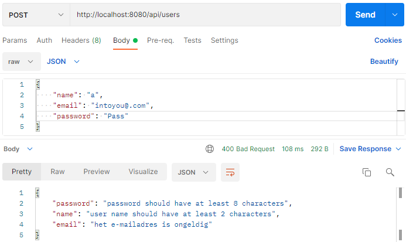
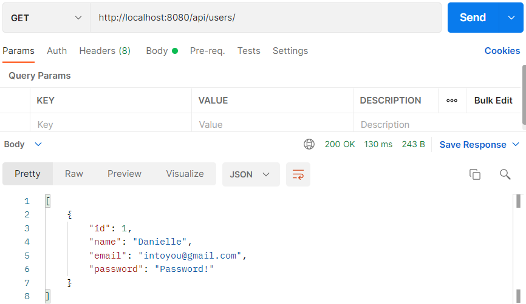

## Project Validator

In dit project leren we hoe je Spring boot REST API verzoeken kan valideren met behulp van Hibernate validator.

In Java is het Java Bean Validation framework de standaard geworden voor het afhandelen van validaties in Java
projecten.

JSR 380 is een specificatie van de Java API voor bean validatie en deze zorgt ervoor dat de eigenschappen van een bean
voldoen aan specifieke criteria, met behulp van annotaties zoals @NotNull, @Min, en @Max.

_Belangrijke Java bean validaties_

- `@NotNull` valideert dat de waarde van de geannoteerde eigenschap niet null is.
- `@Size` valideert dat de waarde van de geannoteerde eigenschap een grootte heeft tussen de attributen min en max; kan
  worden toegepast op String, Collection, Map, en array properties.
- `@Min` valideert dat de geannoteerde eigenschap een waarde heeft die niet kleiner is dan het waarde-attribuut.
- `@Max` bevestigt dat de geannoteerde eigenschap een waarde heeft die niet groter is dan het waarde-attribuut.
- `@Email` bevestigt dat de geannoteerde eigenschap een geldig e-mailadres is.
- `@NotEmpty` valideert dat de eigenschap niet null of leeg is; kan worden toegepast op String, Collection, Map, of
  Array waarden.
- `@NotBlank` kan alleen worden toegepast op tekstwaarden en valideert dat de eigenschap niet null of whitespace is.

### Initializr

Ga naar de website <a href="https://start.spring.io" target="_blank">spring.io</a>. De volgende gegevens vul je in voor
het eerste Spring Boot project.

- Project: vink aan `Maven Project`
- Language: vink aan `Java`
- Spring Boot: vink aan `2.5.5` (laatste versie)
- Project Metadata: vul informatie in over jouw project
    - Group: `nl.danielle` (identifier van de ontwikkelaar)
    - Artifact: `demo_validator` (hoe heet je project)
    - Name: `demo_validator` (hoe heet je project)
    - Description: `Demo project for Spring Boot`
    - Package name: maakt het systeem zelf aan
    - Packaging: vink aan `Jar`
    - Java: vink aan `11`

Klik op "add dependencies" en voeg `Spring Web`, `Spring Data JPA`, `H2 Database` en `Validation` toe.

Met "generate" wordt er een bestand in jouw download map gezet. Unzip het bestand en open het in Intellij.

Klik vervolgens rechtsonder in IntelliJ op `Load`.


Ga naar File > Project Structure en zet `Project SDK` op 11. Klik op apply.

### pom.xml

Wanneer je in `pom.xml` een foutmelding krijgt, zet je de `<parent>` versie op `<version>2.4.3</version>` en wanneer je
een foutmelding in de `<plugin>` krijg zet je de versie er tussen op de volgende
manier: `<version>${project.parent.version}</version>`.

De pom.xml heeft de volgende structuur:

```xml
<?xml version="1.0" encoding="UTF-8"?>
<project xmlns="http://maven.apache.org/POM/4.0.0" xmlns:xsi="http://www.w3.org/2001/XMLSchema-instance"
         xsi:schemaLocation="http://maven.apache.org/POM/4.0.0 https://maven.apache.org/xsd/maven-4.0.0.xsd">
    <modelVersion>4.0.0</modelVersion>
    <parent>
        <groupId>org.springframework.boot</groupId>
        <artifactId>spring-boot-starter-parent</artifactId>
        <version>2.4.3</version>
        <relativePath/> <!-- lookup parent from repository -->
    </parent>
    <groupId>nl.danielle</groupId>
    <artifactId>demo_validator</artifactId>
    <version>0.0.1-SNAPSHOT</version>
    <name>demo_validator</name>
    <description>Demo project for Spring Boot</description>
    <properties>
        <java.version>11</java.version>
    </properties>
    <dependencies>
        <dependency>
            <groupId>org.springframework.boot</groupId>
            <artifactId>spring-boot-starter-data-jpa</artifactId>
        </dependency>
        <dependency>
            <groupId>org.springframework.boot</groupId>
            <artifactId>spring-boot-starter-validation</artifactId>
        </dependency>
        <dependency>
            <groupId>org.springframework.boot</groupId>
            <artifactId>spring-boot-starter-web</artifactId>
        </dependency>
        <dependency>
            <groupId>com.h2database</groupId>
            <artifactId>h2</artifactId>
            <scope>runtime</scope>
        </dependency>
        <dependency>
            <groupId>org.springframework.boot</groupId>
            <artifactId>spring-boot-starter-test</artifactId>
            <scope>test</scope>
        </dependency>
    </dependencies>

    <build>
        <plugins>
            <plugin>
                <groupId>org.springframework.boot</groupId>
                <artifactId>spring-boot-maven-plugin</artifactId>
                <version>${project.parent.version}</version>
            </plugin>
        </plugins>
    </build>

</project>
```

### Model

Maak een nieuwe package aan genaamd `model` met daarin 1 bestand: `User.java`.

```java
package nl.danielle.demo_validator.model;

import javax.persistence.Column;
import javax.persistence.Entity;
import javax.persistence.GeneratedValue;
import javax.persistence.GenerationType;
import javax.persistence.Id;
import javax.persistence.Table;
import javax.validation.constraints.Email;
import javax.validation.constraints.NotEmpty;
import javax.validation.constraints.Size;

@Table(name = "users")
@Entity
public class User {

    @Id
    @GeneratedValue(strategy = GenerationType.IDENTITY)
    private long id;

    @Column(name = "name", nullable = false)

    // user name should not be null or empty
    // user name should have at least 2 characters
    @NotEmpty
    @Size(min = 2, message = "user name should have at least 2 characters")
    private String name;

    // email should be a valid email format
    // email should not be null or empty
    @NotEmpty
    @Email
    private String email;

    // password should not be null or empty
    // password should have at least 8 characters
    @NotEmpty
    @Size(min = 8, message = "password should have at least 8 characters")
    private String password;

    public User() {

    }

    public User(String name, String email, String password) {
        super();
        this.name = name;
        this.email = email;
        this.password = password;
    }

    public long getId() {
        return id;
    }

    public void setId(long id) {
        this.id = id;
    }

    public String getName() {
        return name;
    }

    public void setName(String name) {
        this.name = name;
    }

    public String getEmail() {
        return email;
    }

    public void setEmail(String email) {
        this.email = email;
    }

    public String getPassword() {
        return password;
    }

    public void setPassword(String password) {
        this.password = password;
    }
}
```

- @NotEmpty valideert dat de eigenschap niet null of leeg is; kan worden toegepast op String, Collection, Map, of Array
  waarden.

- @Size valideert dat de waarde van de geannoteerde eigenschap een grootte heeft tussen de attributen min en max; kan
  worden toegepast op String, Collection, Map, en Array eigenschappen.

- @Email valideert dat de geannoteerde eigenschap een geldig e-mailadres is.

### application.properties

Spring boot automatically configure database details for H2 in-memory database so we no need to explicitly add the
database configuration in the `application.properties` file.

### Repository

Maak een nieuwe package aan genaamd `repository` met daarin 1 bestand: `UserRepository.java`. In deze package praat
de `UserRepository` klasse met de database.

```java
package nl.danielle.demo_validator.repository;

import org.springframework.data.jpa.repository.JpaRepository;

import nl.danielle.demo_validator.model.User;

public interface UserRepository extends JpaRepository<User, Long> {

}
```

### Service

Maak een nieuwe package aan genaamd `service` met daarin 1 bestand: `UserService.java`.

```java
package nl.danielle.demo_validator.service;

import org.springframework.beans.factory.annotation.Autowired;
import org.springframework.stereotype.Service;

import nl.danielle.demo_validator.model.User;
import nl.danielle.demo_validator.repository.UserRepository;

import java.util.List;

@Service
public class UserService {

  @Autowired
  private UserRepository userRepository;

  public List<User> getAllUsers() {
    return userRepository.findAll();
  }

  public User createUser(User user) {
    return userRepository.save(user);
  }
}
```

### Controller

Maak een nieuwe package aan genaamd `controller` met daarin 2 bestanden: `UserController.java`
en `ValidationHandler.java`.

```java
package nl.danielle.demo_validator.controller;

import javax.validation.Valid;

import org.springframework.beans.factory.annotation.Autowired;
import org.springframework.http.HttpStatus;
import org.springframework.http.ResponseEntity;
import org.springframework.web.bind.annotation.*;

import nl.danielle.demo_validator.model.User;
import nl.danielle.demo_validator.service.UserService;

import java.util.List;

@RestController
@RequestMapping("/api/")
public class UserController {

  @Autowired
  private UserService userService;

  @GetMapping(value = "users")
  public ResponseEntity<Object> getUser() {
    List<User> users = userService.getAllUsers();
    return new ResponseEntity<>(users, HttpStatus.OK);
  }

  @PostMapping("users")
  public ResponseEntity<User> createUser(@Valid @RequestBody User user){
    User savedUser = userService.createUser(user);
    return new ResponseEntity<User>(savedUser, HttpStatus.CREATED);
  }
}

```

Merk op dat we validatie inschakelen op Spring Rest Controller door `@Valid` annotatie toe te voegen
naast `@RequestBody` in createUser() methode.

```java
package nl.danielle.demo_validator.controller;

import java.util.HashMap;
import java.util.Map;

import org.springframework.http.HttpHeaders;
import org.springframework.http.HttpStatus;
import org.springframework.http.ResponseEntity;
import org.springframework.validation.FieldError;
import org.springframework.web.bind.MethodArgumentNotValidException;
import org.springframework.web.bind.annotation.ControllerAdvice;
import org.springframework.web.context.request.WebRequest;
import org.springframework.web.servlet.mvc.method.annotation.ResponseEntityExceptionHandler;

@ControllerAdvice
public class ValidationHandler extends ResponseEntityExceptionHandler {

    @Override
    protected ResponseEntity<Object> handleMethodArgumentNotValid(MethodArgumentNotValidException ex,
                                                                  HttpHeaders headers, HttpStatus status, WebRequest request) {

        Map<String, String> errors = new HashMap<>();
        ex.getBindingResult().getAllErrors().forEach((error) -> {

            String fieldName = ((FieldError) error).getField();
            String message = error.getDefaultMessage();
            errors.put(fieldName, message);
        });
        return new ResponseEntity<Object>(errors, HttpStatus.BAD_REQUEST);
    }
}
```

### Run de applicatie

### Postman

Test in Postman de volgende URL `http//localhost:8080/api/users` en methode `POST`.



In de body wordt aangegeven wat er fout is gegaan. Met URL `http//localhost:8080/api/users` en `GET` kun je de ingevoerde users opvragen.


