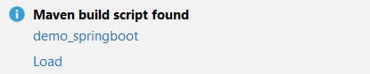

### Initializr

Ga naar de website <a href="https://start.spring.io" target="_blank">spring.io</a>. De volgende gegevens vul je in voor
het eerste Spring Boot project.

- Project: vink aan `Maven Project`
- Language: vink aan `Java`
- Spring Boot: vink aan `2.5.5` (laatste versie)
- Project Metadata: vul informatie in over jouw project
    - Group: `nl.danielle` (identifier van de ontwikkelaar)
    - Artifact: `fileupload` (hoe heet je project)
    - Name: `fileupload` (hoe heet je project)
    - Description: `Demo project for Spring Boot`
    - Package name: maakt het systeem zelf aan
    - Packaging: vink aan `Jar`
    - Java: vink aan `11`

Klik op "add dependencies" en voeg `Spring Web` en `Validation` toe.

Met "generate" wordt er een bestand in jouw download map gezet. Unzip het bestand en open het in Intellij.

Klik vervolgens rechtsonder in IntelliJ op `Load`.



Ga naar File > Project Structure en zet `Project SDK` op 11. Klik op apply.

### pom.xml

Wanneer je in `pom.xml` een foutmelding krijgt, zet je de `<parent>` versie op `<version>2.4.3</version>` en wanneer je een foutmelding in de `<plugin>` krijg zet je de versie er tussen op de volgende manier: `<version>${project.parent.version}</version>`.

De pom.xml heeft de volgende structuur:

```xml
<?xml version="1.0" encoding="UTF-8"?>
<project xmlns="http://maven.apache.org/POM/4.0.0" xmlns:xsi="http://www.w3.org/2001/XMLSchema-instance"
         xsi:schemaLocation="http://maven.apache.org/POM/4.0.0 https://maven.apache.org/xsd/maven-4.0.0.xsd">
  <modelVersion>4.0.0</modelVersion>
  <parent>
    <groupId>org.springframework.boot</groupId>
    <artifactId>spring-boot-starter-parent</artifactId>
    <version>2.4.3</version>
    <relativePath/> <!-- lookup parent from repository -->
  </parent>
  <groupId>nl.danielle</groupId>
  <artifactId>demo_dto</artifactId>
  <version>0.0.1-SNAPSHOT</version>
  <name>demo_dto</name>
  <description>Demo project for Spring Boot</description>
  <properties>
    <java.version>11</java.version>
  </properties>
  <dependencies>
    <dependency>
      <groupId>org.springframework.boot</groupId>
      <artifactId>spring-boot-starter-validation</artifactId>
    </dependency>
    <dependency>
      <groupId>org.springframework.boot</groupId>
      <artifactId>spring-boot-starter-web</artifactId>
    </dependency>

    <dependency>
      <groupId>org.springframework.boot</groupId>
      <artifactId>spring-boot-starter-test</artifactId>
      <scope>test</scope>
    </dependency>
  </dependencies>

  <build>
    <plugins>
      <plugin>
        <groupId>org.springframework.boot</groupId>
        <artifactId>spring-boot-maven-plugin</artifactId>
        <version>${project.parent.version}</version>
      </plugin>
    </plugins>
  </build>

</project>
```

